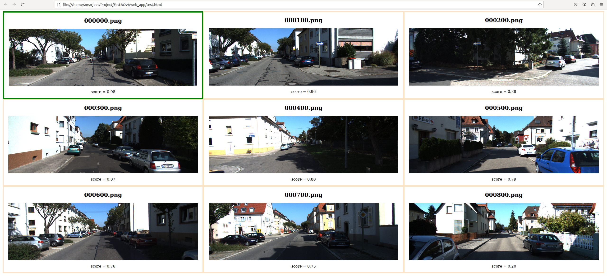
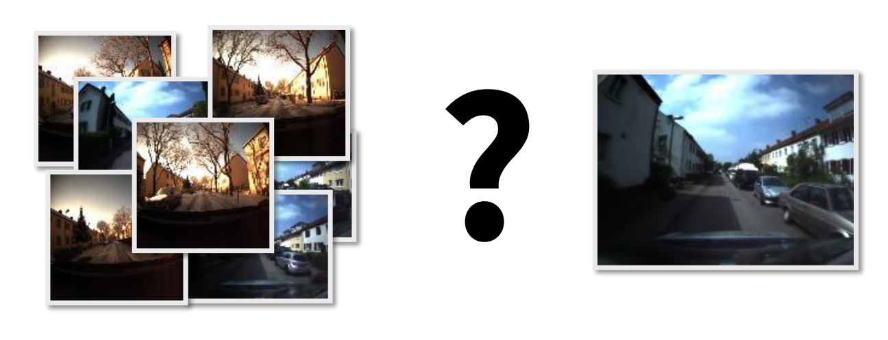

Documentation page of Fast Bag of Words(FastBOW) 

libraries generate after cmake .. && make

1. **image_browser**   : create an image browser web application **(done)**
  
  
2. **sift_desctiptor** : given a database generate sift descriptors and serialize them **(done)**
3. **bow_dictionary**  : create bow cookbook using k-means clustering **(done)**
4. **bow_histogram**   : given sift feature and bow dictionary generate histogram
5. **bow_compare**     : compare bow histogram of query image with database

### Background

#### What is Bag Of Words ?
The Bag of Visual Words (BOVW) model is a technique in computer vision that allows for the compact representation of images. With BOVW, images are represented using a collection of visual words, enabling efficient storage and retrieval. This model excels at performing similarity comparisons in a database when given a query image.

  

#### Where it is used ? 
1. **E-commerce and Cloud Applications**: BOVW can be used in online applications such as e-commerce and cloud services, where users can search for images based on their visual content [1](https://www.researchgate.net/publication/306362856_Using_Bag_of_Visual_Words_and_Spatial_Pyramid_Matching_for_Object_Classification_Along_with_Applications_for_RIS)
2. **Medical Image Retrieval**: BOVW can be used in image retrieval systems, where the goal is to find similar images based on their visual content [1](https://arxiv.org/abs/2007.09464v1), [2](https://www.sciencedirect.com/science/article/pii/S131915781830750X)

#### Implementation details - 
- [ ] background explanation and brief working of each library

#### Todo:
- [ ] beautify readme.md
- [ ] add requirements.txt file - opencv, fmt etc (maybe create a docker image ?)
- [ ] complete bow-hist library 
- [ ] add unit test
   
#### Motivation -
Just for fun 😄 (70%), improve C++ and OOP skills as well practice cmake, gtest
